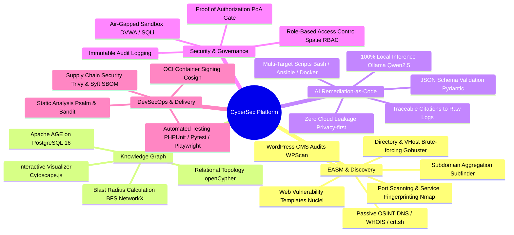
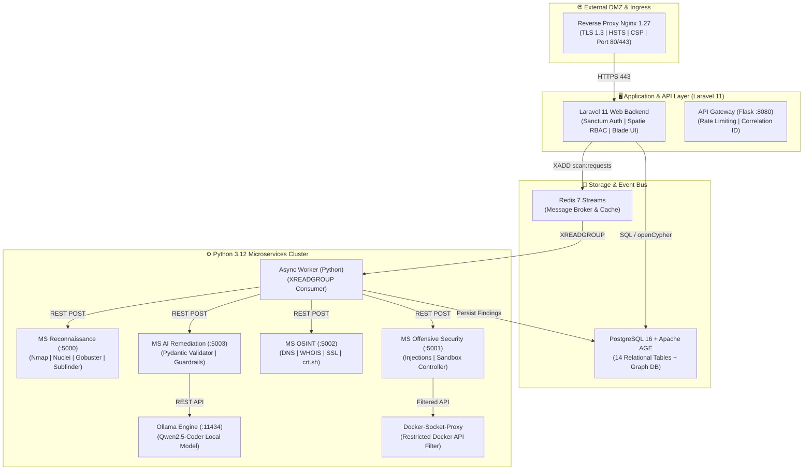
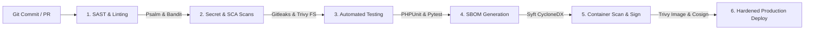

# 🛡️ CyberSec Platform — Automated Attack Surface Management & Security Operations

<div align="center">

[](https://github.com/AymenAzizi/CyberSec-Platform/actions/workflows/devsecops.yml)
[](https://psalm.dev/)
[](https://github.com/PyCQA/bandit)
[](https://trivy.dev/)
[](https://github.com/anchore/syft)
[](https://sigstore.dev/)
[](https://www.docker.com/)
[](https://laravel.com/)
[](https://www.python.org/)
[](https://age.apache.org/)
[](https://redis.io/)
[](https://ollama.com/)
[-brightgreen.svg)](tests/)
[](LICENSE)

**An enterprise-grade, semi-agentic Cybersecurity Operations and External Attack Surface Management (EASM) Platform featuring multi-scanner orchestration, graph-based blast radius modeling, local constrained AI Remediation-as-Code, and end-to-end DevSecOps automation.**

[🌐 Live Production Instance](https://aymenazizi.dijaly.com/) • [📑 Academic Report (99 Pages PDF)](rapport/main.pdf) • [🚀 Quickstart](#-quickstart--installation) • [🏗️ Architecture](#-system-architecture) • [📊 Benchmarks](#-testing-quality-assurance--benchmarks)

</div>

---

## 📑 Table of Contents

- [Executive Summary](#-executive-summary)
- [Key Features & Capabilities](#-key-features--capabilities)
- [System Architecture & Microservices](#-system-architecture)
- [DevSecOps & Software Supply Chain](#-devsecops-pipeline--software-supply-chain)
- [Repository Structure](#-repository-structure)
- [RESTful API Reference](#-restful-api-reference)
- [Quickstart & Installation](#-quickstart--installation)
- [Testing, Quality Assurance & Benchmarks](#-testing-quality-assurance--benchmarks)
- [Engineering Challenges & Mitigations](#-engineering-challenges--mitigations)
- [Academic Context & PFE Deliverable](#-academic-context--pfe-deliverable)
- [License](#-license)

---

## 🎯 Executive Summary

Modern enterprise attack surfaces are highly fragmented across multi-cloud environments, distributed APIs, remote endpoints, and ephemeral subdomains. Traditional manual penetration testing and siloed vulnerability assessments suffer from high latency, operational costs, lack of transverse asset correlation, and elevated Mean-Time-To-Remediate (MTTR).

The **CyberSec Platform** solves these challenges by unifying the full reconnaissance and vulnerability lifecycle into a single, high-performance distributed architecture:
1. **Continuous EASM Discovery & Multi-Scanner Orchestration:** Encapsulates Nmap, Nuclei, Gobuster, Subfinder, and WPScan within containerized adapters featuring intensity profiles (*Silent*, *Balanced*, *Aggressive*) and jitter.
2. **Unified Data Normalization:** Transforms heterogeneous outputs into standardized, SHA-256 deduplicated `Finding` entities mapped to CVSS v3.1 and CVE/CWE repositories.
3. **Knowledge Graph & Blast Radius Analysis:** Models the relational topology in **Apache AGE** (openCypher) and computes propagation risk via **NetworkX BFS** algorithms in $<75\text{ ms}$.
4. **Local Constrained AI Remediation-as-Code:** Employs a 100% local, privacy-preserving LLM (**Ollama / Qwen2.5-Coder**) with strict Pydantic JSON Schema enforcement and required raw-log citations to generate deterministic hardening scripts (Bash, Ansible, Dockerfile, Terraform).
5. **Intrinsically Hardened DevSecOps:** Enforces non-root containers, read-only root filesystems, Docker daemon proxy isolation, and a blocking CI/CD pipeline (SAST, SCA, CycloneDX SBOM, Trivy, and Cosign image signing).

---

## 🌟 Key Features & Capabilities



### 1. Multi-Tool Scanner Orchestration
- **Supported Scanners:** Nmap 7.94, Nuclei v3.2, Gobuster v3.6, Subfinder v2.6, WPScan v3.8.
- **Scan Profiles:**
  - `Silent`: Slow rate-limiting, timing template `T1`/`T2`, anti-WAF jitter, passive OSINT.
  - `Balanced`: Optimized timing `T3`, comprehensive service versioning, top ports.
  - `Aggressive`: Multi-threaded `T4`, full port sweep (`1-65535`), aggressive NSE scripts.
- **Mandatory Proof of Authorization (PoA):** Enforces cryptographic SHA-256 verification and client sign-off before any active scan execution, ensuring total compliance with legal frameworks (Budapest Convention, ISO/IEC 27001).

### 2. Knowledge Graph & Blast Radius Engine
- Graph nodes: `Target` $\rightarrow$ `Asset` $\rightarrow$ `Port` $\rightarrow$ `Service` $\rightarrow$ `Vulnerability` $\rightarrow$ `Impact`.
- Hybrid relational & graph querying via **Apache AGE** openCypher extensions on PostgreSQL 16.
- Algorithm: In-memory **Breadth-First Search (BFS)** up to depth $k_{max}=3$ with edge-weight risk scoring to identify lateral movement risk and cascading compromise paths.

### 3. Local Constrained AI Engine (Remediation-as-Code)
- **Zero Third-Party API Dependence:** Executes entirely on local hardware via **Ollama** running `qwen2.5-coder:7b-instruct-q4_K_M`.
- **Anti-Hallucination Guardrails:** Strict prompt templates require explicit `line_start` and `line_end` citations pointing to raw evidence files.
- **Deterministic Fallback:** Automatically reverts to pre-validated security hardening templates if the model generates invalid JSON syntax.

### 4. Defensive Isolated Sandbox
- Manages pre-configured vulnerable benchmark containers (DVWA, SQLi-Labs, WebGoat, bWAPP) for safe validation of detection capabilities.
- Intercepts all Docker API calls through **Docker-Socket-Proxy**, prohibiting privileged modes, image deletions, and host volume mounts.

### 5. Enterprise Multi-Format Reporting
- Generates certified, tamper-evident executive and technical security reports in **Signed PDF**, **Machine-Readable JSON**, and **Zipped Evidence Archives**.

---

## 🏗️ System Architecture

The platform is designed around a decoupled, 12-container microservices architecture orchestrated via Docker Compose:



### Infrastructure Containers (12 Services)

| # | Container Name | Technology | Port / Scope | Role & Responsibilities |
| :-: | :--- | :--- | :--- | :--- |
| **1** | `cybersec-nginx` | Nginx 1.27 Alpine | `80:80`, `443:443` | Reverse proxy, TLS 1.3 termination, security headers (HSTS, CSP). |
| **2** | `cybersec-backend` | Laravel 11 (PHP 8.3) | `8000` (Internal) | Web portal, Eloquent ORM, Sanctum auth, Spatie RBAC, Blade UI. |
| **3** | `cybersec-postgres` | PostgreSQL 16 + Apache AGE | `5432` (Internal) | Unified relational database (14 tables) and openCypher graph store. |
| **4** | `cybersec-redis` | Redis 7.2 Alpine | `6379` (Internal) | Persistent Streams message broker, queue coordinator, and cache. |
| **5** | `cybersec-recon` | Python 3.12 / Flask | `5000` (Internal) | Adapter execution for Nmap, Nuclei, Gobuster, Subfinder, WPScan. |
| **6** | `cybersec-security`| Python 3.12 / Flask | `5001` (Internal) | Non-destructive injection evaluations and sandbox container manager. |
| **7** | `cybersec-osint` | Python 3.12 / Flask | `5002` (Internal) | Passive reconnaissance (DNS, WHOIS, CT logs, tech detection). |
| **8** | `cybersec-ai` | Python 3.12 / Flask | `5003` (Internal) | Prompt engineering, Pydantic JSON validation, citation verifier. |
| **9** | `cybersec-gateway` | Python 3.12 / Flask | `8080` (Internal) | Internal API router, rate limiting, and request tracing. |
| **10**| `cybersec-worker` | Python 3.12 | Background | Async Redis Streams consumer (`XREADGROUP`), automatic retries. |
| **11**| `cybersec-ollama` | Ollama Engine | `11434` (Internal) | Headless local LLM server hosting `qwen2.5-coder:7b`. |
| **12**| `docker-socket-proxy`| HAProxy Proxy | `2375` (Internal) | Restricts Docker daemon socket access, preventing container breakout. |

---

## 🔄 DevSecOps Pipeline & Software Supply Chain

The repository implements a strict **Shift-Left DevSecOps** pipeline automated via GitHub Actions (`.github/workflows/devsecops.yml`):



1. **Static Application Security Testing (SAST):**
   - **PHP / Laravel:** Psalm Level 3 (0 errors).
   - **Python Microservices:** Bandit AST vulnerability analysis (0 high/medium issues).
2. **Secret Leak Detection:**
   - **Gitleaks:** Continuous detection of high-entropy strings, RSA keys, and API tokens.
3. **Software Composition Analysis (SCA) & Container Scanning:**
   - **Trivy Filesystem & Container Scanner:** Detects CVEs across OS packages and third-party dependencies.
4. **Software Bill of Materials (SBOM):**
   - **Syft:** Generates machine-readable SBOM files conforming to the **CycloneDX** standard.
5. **Cryptographic Attestation & Signing:**
   - **Cosign (Sigstore):** Cryptographically signs all OCI container images pushed to GitHub Container Registry (`ghcr.io`).

---

## 📁 Repository Structure

```
cybersec-workspace-full/
├── .github/
│   └── workflows/
│       └── devsecops.yml              # Complete GitHub Actions CI/CD pipeline
├── cybersec-workspace/
│   ├── platform/                      # Laravel 11 Backend & Microservices
│   │   ├── app/                       # Laravel Controllers, Models, Jobs, Middleware
│   │   │   ├── Http/Controllers/      # ScanController, ProjectController, FindingController...
│   │   │   ├── Jobs/                  # ExecuteScan, ExportReport, ProcessAIJob...
│   │   │   ├── Models/                # Eloquent models (Project, Scan, Finding, Asset...)
│   │   │   └── Services/              # ScanOrchestrationService, GraphDataService...
│   │   ├── database/                  # Migrations (14 tables) & Seeders
│   │   ├── microservices/             # Standalone Python Flask Services
│   │   │   ├── reconnaissance/        # Nmap, Nuclei, Gobuster, Subfinder adapters
│   │   │   ├── security/              # Injection testing & sandbox manager
│   │   │   ├── osint/                 # DNS, WHOIS, crt.sh passive recon modules
│   │   │   ├── ai/                    # Constrained LLM & Pydantic schema validation
│   │   │   ├── api-gateway/           # Rate limiting gateway
│   │   │   └── worker/                # Redis Streams async consumer daemon
│   │   ├── resources/                 # Blade templates, Tailwind CSS, Cytoscape.js
│   │   ├── routes/                    # Web & REST API routes
│   │   ├── tests/                     # Automated Test Suites
│   │   │   ├── Feature/ & Unit/       # PHPUnit 11 test suite (42 tests)
│   │   │   └── e2e/                   # Playwright End-to-End test suite (12 suites)
│   │   ├── docker/                    # Custom Dockerfiles for each service
│   │   ├── docker-compose.yml         # 12-container orchestration manifest
│   │   └── docker-compose.prod.yml    # Production-hardened deployment manifest
│   ├── rapport/                       # 99-Page Master Academic Thesis (LaTeX)
│   │   ├── main.tex                   # Master LaTeX document
│   │   ├── global_config.tex          # LaTeX packages & project metadata
│   │   ├── introduction.tex           # Introduction & comparative TiKZ figures
│   │   ├── chap_01.tex                # Context, Designet Web Agency, Scrum framework
│   │   ├── chap_02.tex                # State of the Art, DevSecOps, ASM, Comparatives
│   │   ├── chap_03.tex                # Requirements, UML/ERD, STRIDE threat modeling
│   │   ├── chap_04.tex                # Implementation, 15 Screenshots, Benchmarks
│   │   ├── conclusion.tex             # Synthesis, Soft Skills, Perspectives
│   │   ├── annexes.tex                # API catalog, Docker & Nginx hardening, openCypher
│   │   ├── webo.tex                   # Bibliography (NIST, ISO/IEC 27001, MITRE ATT&CK)
│   │   ├── img/                       # High-resolution screenshots & diagrams
│   │   └── main.pdf                   # Fully compiled 99-page PDF deliverable
│   └── README.md                      # Platform documentation & quickstart
```

---

## 🔌 RESTful API Reference

The platform provides a secure, versioned RESTful API protected by Laravel Sanctum Bearer tokens and role-based permissions:

| Method | Endpoint | Description | Authorized Roles |
| :--- | :--- | :--- | :--- |
| `POST` | `/api/v1/auth/login` | Authenticate user & issue Sanctum API token | Public |
| `GET` | `/api/v1/projects` | List projects with real-time audit statistics | Admin, Analyst, Client |
| `POST` | `/api/v1/projects` | Create a new project with mandatory PoA file | Admin, Analyst |
| `POST` | `/api/v1/scans` | Dispatch asynchronous scan task to Redis Streams | Admin, Analyst |
| `GET` | `/api/v1/scans/{id}` | Retrieve scan execution progress and metrics | Admin, Analyst, Client |
| `GET` | `/api/v1/findings` | List and filter normalized vulnerability findings | Admin, Analyst, Client |
| `GET` | `/api/v1/findings/{id}` | Get detailed finding with raw technical evidence | Admin, Analyst, Client |
| `POST` | `/api/v1/findings/{id}/remediate` | Trigger local AI Remediation-as-Code generation | Admin, Analyst |
| `GET` | `/api/v1/projects/{id}/graph` | Fetch openCypher graph topology for Cytoscape.js | Admin, Analyst, Client |
| `GET` | `/api/v1/assets/{id}/impact` | Calculate BFS blast radius lateral propagation | Admin, Analyst |
| `POST` | `/api/v1/reports/{id}/generate` | Request asynchronous compilation of audit report | Admin, Analyst, Client |
| `GET` | `/api/v1/audit-logs` | Query tamper-evident administrative audit trail | Admin, Auditor |

### Sample Normalized Finding Response (`GET /api/v1/findings/442`)

```json
{
  "status": "success",
  "data": {
    "id": 442,
    "scan_id": 87,
    "target": "ensit.tn",
    "port": 22,
    "service": "OpenSSH 8.9p1 Ubuntu",
    "title": "SSH Password Authentication Enabled",
    "severity": "medium",
    "cvss_score": 5.3,
    "cve_id": "CVE-2023-48795",
    "cwe_id": "CWE-287",
    "evidence_file": "nmap_scan_87.xml",
    "remediation": {
      "type": "ansible",
      "summary": "Disable SSH password authentication and root login",
      "script_content": "---\n- name: SSH Server Hardening\n  hosts: all\n  become: yes\n  tasks:\n    - name: Disable PasswordAuth\n      lineinfile:\n        path: /etc/ssh/sshd_config\n        regexp: '^#?PasswordAuthentication'\n        line: 'PasswordAuthentication no'\n        state: present\n    - name: Restart sshd\n      service:\n        name: sshd\n        state: restarted",
      "citations": {
        "source_file": "nmap_scan_87.xml",
        "line_start": 84,
        "line_end": 96
      }
    },
    "created_at": "2026-08-22T10:42:33Z"
  }
}
```

---

## 🚀 Quickstart & Installation

### Prerequisites
- **Docker Engine 24.0+** and **Docker Compose v2.20+**
- **Git**
- Hardware: Minimum 8 GB RAM (16 GB recommended for local LLM inference)

### 1. Clone & Setup Environment

```bash
git clone https://github.com/AymenAzizi/CyberSec-Platform.git
cd CyberSec-Platform/cybersec-workspace/platform
cp .env.example .env
```

### 2. Launch the Microservices Cluster

```bash
docker compose up -d --build
```

### 3. Initialize Database, Graph Extension & Seeders

```bash
docker compose exec backend php artisan migrate --seed
docker compose exec backend php artisan age:init-graph
```

### 4. Pull the Local AI Model (Ollama)

```bash
docker compose exec ollama ollama pull qwen2.5-coder:7b
```

### 5. Access the Platform

- **Web Dashboard:** `http://localhost:3000` (or `https://localhost` if using TLS proxy)
- **Default Accounts:**
  - **Administrator:** `admin@cybersec.local` / `password`
  - **Security Analyst:** `analyst@cybersec.local` / `password`
  - **Auditor / Compliance:** `auditor@cybersec.local` / `password`
  - **Client / Viewer:** `client@cybersec.local` / `password`

---

## 📊 Testing, Quality Assurance & Benchmarks

### Test Suite Execution Summary (100% Success Rate)

| Test Layer | Framework | Test Count | Passing | Success Rate |
| :--- | :--- | :---: | :---: | :---: |
| **Laravel Backend (Auth, RBAC, PoA, Scans)** | PHPUnit 11 / Pest | 42 | 42 | **100%** |
| **Reconnaissance Microservice (Adapters, Parsing)** | Pytest | 28 | 28 | **100%** |
| **Offensive Security & Sandbox Controller** | Pytest | 18 | 18 | **100%** |
| **Passive OSINT Suite (DNS, WHOIS, SSL)** | Pytest | 14 | 14 | **100%** |
| **AI Remediation & Pydantic Schema Validator** | Pytest | 12 | 12 | **100%** |
| **API Gateway & Rate Limiting** | Pytest | 10 | 10 | **100%** |
| **Redis Streams Worker & Event Consumer** | Pytest | 8 | 8 | **100%** |
| **Playwright End-to-End User Journey Tests** | Playwright (TypeScript) | 12 | 12 | **100%** |
| **Total Automated Tests** | | **144** | **144** | **100%** |

### Locust Performance & Load Benchmarks (50 Concurrent Users)

- **Average HTTP Latency (P50):** `64 ms`
- **95th Percentile Latency (P95):** `112 ms`
- **Graph BFS Blast Radius Traversal ($k=3$):** `72 ms`
- **Local AI Remediation Inference ($P50$):** `6.4 s` (CPU quantized mode)
- **HTTP Error Rate under Load:** `0.00%`

```bash
# Run backend unit and integration tests
docker compose exec backend php artisan test

# Run microservices unit tests
docker compose exec recon pytest
docker compose exec ai pytest

# Run full Playwright E2E suite
npx playwright test
```

---

## 🛠️ Engineering Challenges & Mitigations

1. **Apache AGE & PostgreSQL 16 Integration:**
   - *Challenge:* Compiling Apache AGE 1.5 against PostgreSQL 16 with PDO type conversion.
   - *Solution:* Built a custom hardened Alpine PostgreSQL image pre-loading `age.so` and developed a Laravel `GraphDataService` wrapper for raw `agtype` serialization.
2. **Local LLM Latency & Anti-Hallucination Guardrails:**
   - *Challenge:* CPU inference latency on 7B models and risks of synthetic command injection.
   - *Solution:* Adopted `qwen2.5-coder:7b-instruct-q4_K_M` (4.7 GB footprint) with Pydantic schema validation enforcing exact line-number citations to raw logs, backed by deterministic fallback templates.
3. **Hermetic Docker Sandbox Confinement:**
   - *Challenge:* Creating dynamic test containers (DVWA, SQLi-Labs) without exposing `/var/run/docker.sock`.
   - *Solution:* Interposed **Docker-Socket-Proxy** allowing only `POST /containers/create` and `POST /containers/start`, strictly forbidding privileged modes and host mounts.
4. **Heterogeneous Scanner Normalization:**
   - *Challenge:* Harmonizing disparate XML, JSON-Lines, and unstructured CLI text outputs.
   - *Solution:* Designed the Adapter Pattern via `BaseScannerService` and implemented `ResultParser` with SHA-256 fingerprint hashing (`target + port + vuln_id`).
5. **Redis Streams Worker Resiliency:**
   - *Challenge:* Preventing message loss during sudden worker container restarts under high load.
   - *Solution:* Implemented consumer groups with explicit `XACK` acknowledgment and a Pending Entries List (PEL) recovery daemon.

---

## 🎓 Academic Context & PFE Deliverable

This project was conceived and developed as a **Final Year Engineering Project (Projet de Fin d'Études — PFE)** for the National Engineering Diploma in Computer Systems & Network Security (**SSIR**).

- **Academic Institution:** [TEK-UP Private Higher School of Technologies and Engineering](https://tek-up.de/)
- **Host Company:** [Designet Web Agency](https://designet.tn/), Sousse, Tunisia
- **Author / Candidate:** **Aymen AZIZI**
- **Industrial Supervisor (Company CTO):** **M. Ali DORBOZ**
- **Academic Supervisor (University):** **Mme Sonia BEN AISSA**
- **Academic Year:** 2025 – 2026
- **Complete Thesis Document:** [`rapport/main.pdf`](rapport/main.pdf) — **99 pages** structured according to academic standards (IEEE/ISO), detailing the state of the art, STRIDE threat modeling, microservices architecture, and empirical experimental validation.

---

## 📜 License

This project is licensed under the **MIT License** — see the [LICENSE](LICENSE) file for details.

```
Copyright (c) 2026 Aymen AZIZI — CyberSec Platform
```
