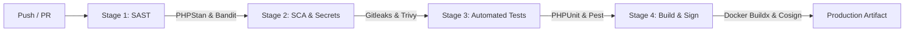

# 🛡️ CyberSec Platform — Automated Security Operations & ASM Platform

[](https://github.com/AymenAzizi/CyberSec-Platform/actions/workflows/devsecops.yml)
[](https://github.com/PyCQA/bandit)
[](https://phpstan.org/)
[](https://trivy.dev/)
[](https://www.docker.com/)
[](https://laravel.com/)
[](https://www.python.org/)
[](LICENSE)

An enterprise-grade, modular Cybersecurity Operations and Attack Surface Management (**ASM**) Platform engineered for end-to-end vulnerability lifecycle management, automated reconnaissance, blast-radius graph modeling, and AI-assisted Remediation-as-Code.

---

## 🏗️ Architecture & Microservices Overview

The platform is designed around an event-driven microservices architecture communicating via asynchronous Redis Streams and REST APIs:

```
[ Web Browser ]
      │
      ▼ (Port 3000 / 443 TLS 1.3)
[ cybersec-nginx (Reverse Proxy & Security Headers) ]
      │
      ├──────────────────────────────┐
      ▼ (FastCGI)                    ▼ (HTTP 8080)
[ cybersec-backend ]           [ cybersec-api-gateway ]
 (Laravel 11 / PHP 8.3)         (Rate Limiting & Proxy)
      │                              │
      ├─► PostgreSQL 16 (Relational + Graph via Apache AGE)
      ├─► Redis 7 (Queues, Streams, Caching)
      │
      ▼
[ Microservices Cluster (Python 3.11) ]
 ├── cybersec-recon       : Nmap, Nuclei, Gobuster, Subfinder, WPScan orchestration
 ├── cybersec-security    : Offensive security validations & injection testing
 ├── cybersec-osint       : Passive intelligence (DNS, WHOIS, CT Logs crt.sh)
 ├── cybersec-ai          : Local constrained LLM (Qwen 2.5 Coder via Ollama)
 ├── cybersec-worker      : Asynchronous job consumption & Redis Streams worker
 └── cybersec-socket-proxy: Isolated Docker daemon proxy for defensive Sandbox
```

---

## 🌟 Key Platform Modules

| Module | Features & Capabilities |
| :--- | :--- |
| **Attack Surface Management (ASM)** | Dynamic discovery, continuous asset inventory, and subdomain enumeration. |
| **Multi-Scanner Orchestration** | Asynchronous execution of Nmap, Nuclei, Gobuster, Subfinder with customizable scan profiles (*Silent*, *Balanced*, *Aggressive*). |
| **Findings Normalization Engine** | Automated ingestion pipeline mapping raw scan outputs into structured CVSS v3.1 and CVE entries. |
| **Knowledge Graph & Blast Radius** | Interactive Cytoscape.js visualization with Breadth-First Search (**BFS**) propagation algorithms. |
| **Remediation-as-Code (RaC)** | Local generative AI generating verifiable Ansible playbooks, Bash hardening scripts, and Dockerfiles. |
| **Passive OSINT Suite** | Multi-vector reconnaissance across DNS records, WHOIS data, and Certificate Transparency logs. |
| **Offensive Security Sandbox** | Air-gapped container management for safe validation of vulnerable targets. |
| **Role-Based Access Control (RBAC)** | Strict privilege separation (*Admin*, *Analyst*, *Client*, *Auditeur*) with immutable audit logging. |

---

## 🔄 DevSecOps Continuous Integration Pipeline

Our pipeline enforces security and quality checks at every commit and pull request:



1. **SAST (Static Application Security Testing):**
   * PHPStan (Level 5) for strict type safety.
   * Bandit for Python AST security analysis.
2. **Secret Leak Prevention:**
   * Gitleaks scanning for high-entropy secrets and exposed credentials.
3. **SCA & Vulnerability Audits:**
   * Trivy filesystem and dependency CVE scans.
4. **Automated Testing Suite:**
   * Unit and feature tests across Laravel and Python services.
5. **Supply Chain Security:**
   * Cosign cryptographic keyless image signing and attestation.

---

## 🚀 Quickstart & Local Deployment

### Prerequisites
* Docker Engine 24.0+ & Docker Compose v2
* Git

### Step-by-Step Installation

1. **Clone the repository:**
   ```bash
   git clone https://github.com/AymenAzizi/CyberSec-Platform.git
   cd CyberSec-Platform/platform
   ```

2. **Configure Environment:**
   ```bash
   cp .env.example .env
   ```

3. **Start the Microservices Cluster:**
   ```bash
   docker compose up -d
   ```

4. **Initialize Database & Seeders:**
   ```bash
   docker compose exec backend php artisan migrate --seed
   ```

5. **Access the Web Interface:**
   * **URL:** [http://localhost:3000](http://localhost:3000)
   * **Admin Credentials:** `admin@cybersec.local` / `password`
   * **Analyst Credentials:** `analyst@cybersec.local` / `password`

---

## 📄 License & Academic Attribution

Developed as a Final Year Engineering Project (**Projet de Fin d'Études — PFE**) at **TEK-UP University**.

Licensed under the [MIT License](LICENSE).
